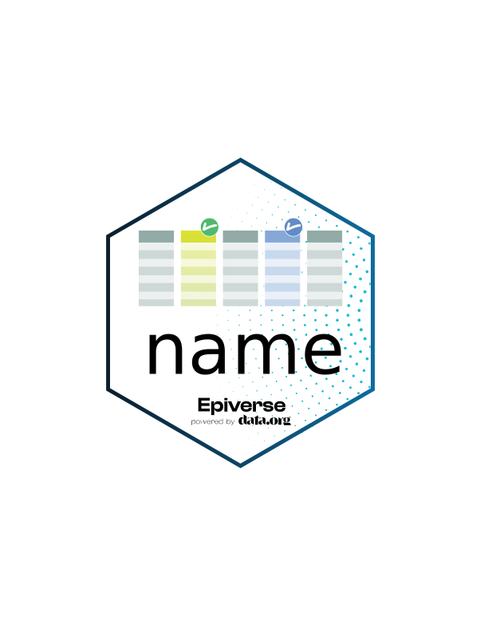

<!-- README.md is generated from README.Rmd. Please edit that file. -->
<!-- The code to render this README is stored in .github/workflows/render-readme.yaml -->
<!-- Variables marked with double curly braces will be transformed beforehand: -->
<!-- `packagename` is extracted from the DESCRIPTION file -->
<!-- `gh_repo` is extracted via a special environment variable in GitHub Actions -->

```{r, include = FALSE}
knitr::opts_chunk$set(
  collapse = TRUE,
  comment = "#>",
  fig.path = "man/figures/README-",
  out.width = "100%"
)
```

# *datatagr*: Generic Data Labelling and Validating 

<!-- badges: start -->

[](https://opensource.org/license/mit/)
[](https://github.com/epiverse-trace/datatagr/actions/workflows/R-CMD-check.yaml)
[](https://app.codecov.io/gh/epiverse-trace/datatagr?branch=main)
[](https://www.reconverse.org/lifecycle.html#experimental)

<!-- badges: end -->

**datatagr** provides functions to label and validate data of any kind. datatagr is an abstraction from [**linelist**](https://github.com/epiverse-trace/linelist), which applies these principles to epidemiological linelist data. The original proposal for this package can be found on [the Discussion board](https://github.com/orgs/epiverse-trace/discussions/221).

## Installation

You can install the development version of datatagr from
[GitHub](https://github.com/) with:

```r
# install.packages("pak")
pak::pak("epiverse-trace/datatagr")
```

## Getting started

```r
library(datatagr)

# Create a datatagr object
x <- make_datatagr(cars, speed = 'Miles per hour', dist = 'Distance in miles')

# Validate the data are of a specific type
validate_datatagr(x, 
  speed = 'numeric',        # speed should be numeric
  # type() is a helper function of related classes
  dist = type('numeric')    # dist should be numeric, integer
)
```

## Development

### Lifecycle

This package is currently *experimental*, as defined by the [RECON software
lifecycle](https://www.reconverse.org/lifecycle.html). This means that essential
features and mechanisms are still being developed, and the package is not ready
for use outside of the development team.

### Contributions

Contributions are welcome via [pull requests](https://github.com/epiverse-trace/datatagr/pulls). Anything bigger than a typo fix or a small documentation update should be discussed in an issue first. If you want to report a bug or suggest an enhancement, please open an issue. 😊 See also [the general Epiverse TRACE contribution document](https://github.com/epiverse-trace/.github/blob/main/CONTRIBUTING.md).

<details>
  <summary>Common issues</summary>

To make it easier for us to evaluate your contribution, please run the following commands before submitting a pull request to ensure your code is consistent with the rest of the package:

```r
styler::style_pkg()
spelling::update_wordlist(pkg = ".", vignettes = TRUE)
devtools::document()

lintr::lint_package()

devtools::test()
devtools::check()
```

This will reduce the time it takes for us to review your contribution. Thank you! 😊

</details>


### Related projects

This project is related to other existing projects in R or other languages, but also differs from them in the following aspects:

- [labelled](https://github.com/larmarange/labelled/): A package for labelling data in R, but it is more focused on labelling variables than validating them.
- [linelist](https://github.com/epiverse-trace/linelist): A package for managing and validating linelist data - the original inspiration for datatagr.

### Code of Conduct

Please note that the datatagr project is released with a
[Contributor Code of Conduct](https://github.com/epiverse-trace/.github/blob/main/CODE_OF_CONDUCT.md).
By contributing to this project, you agree to abide by its terms.
